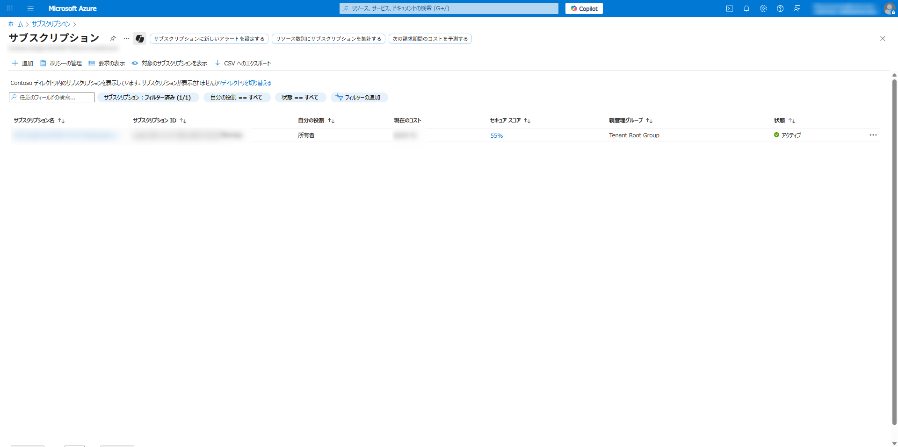
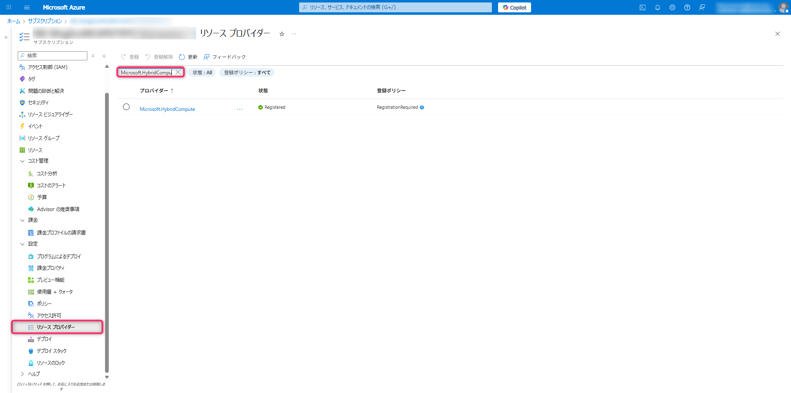
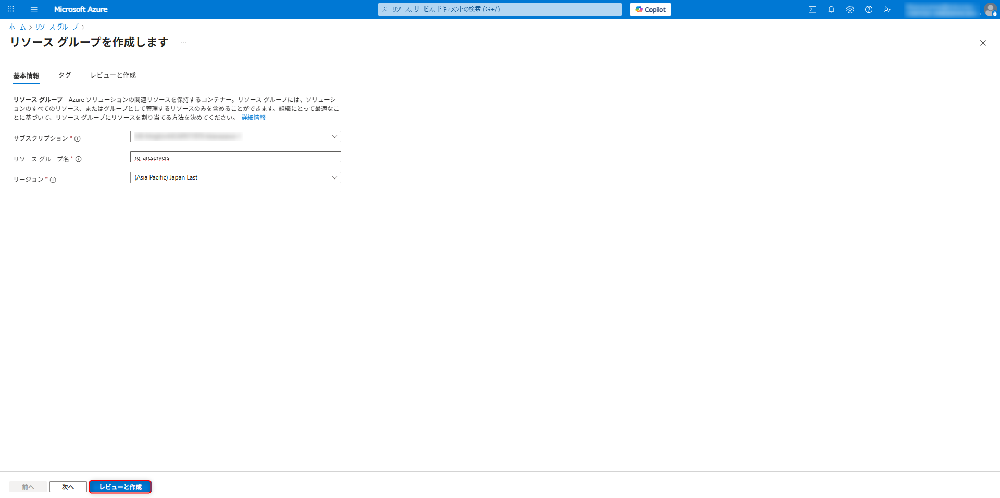
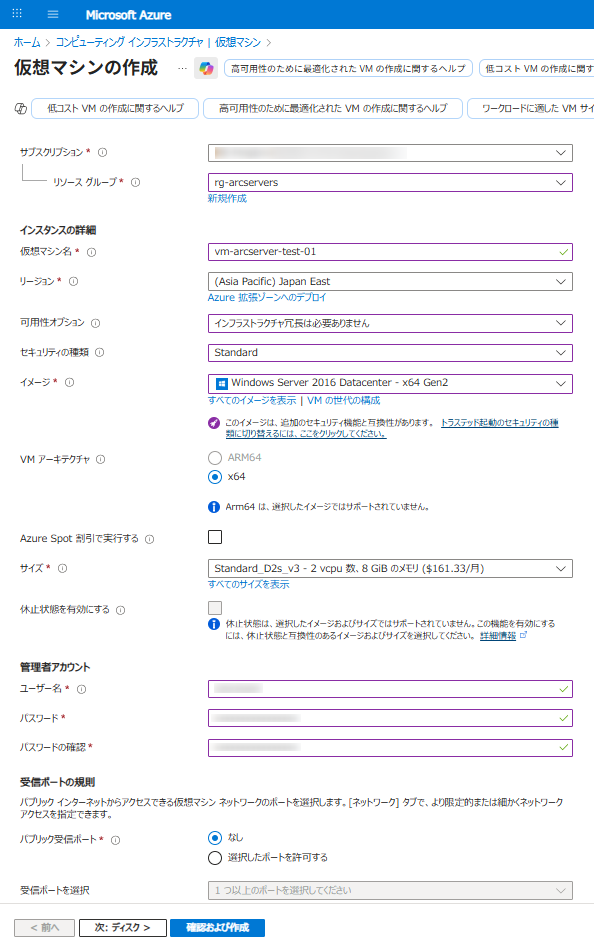
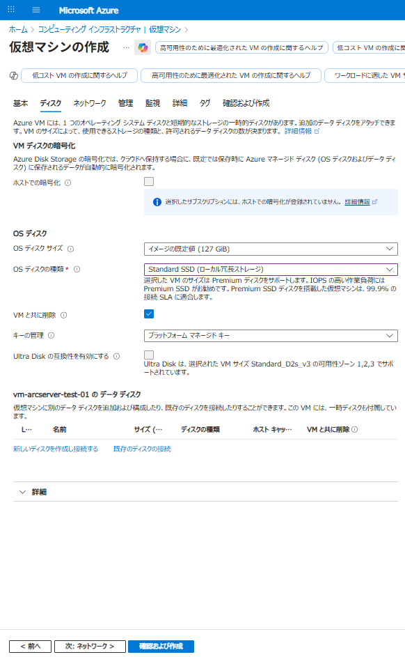
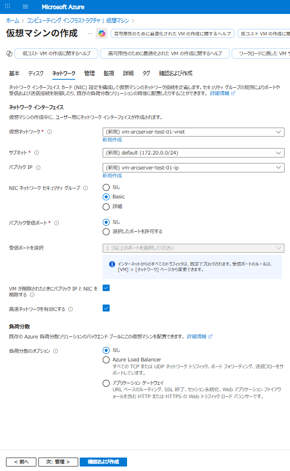
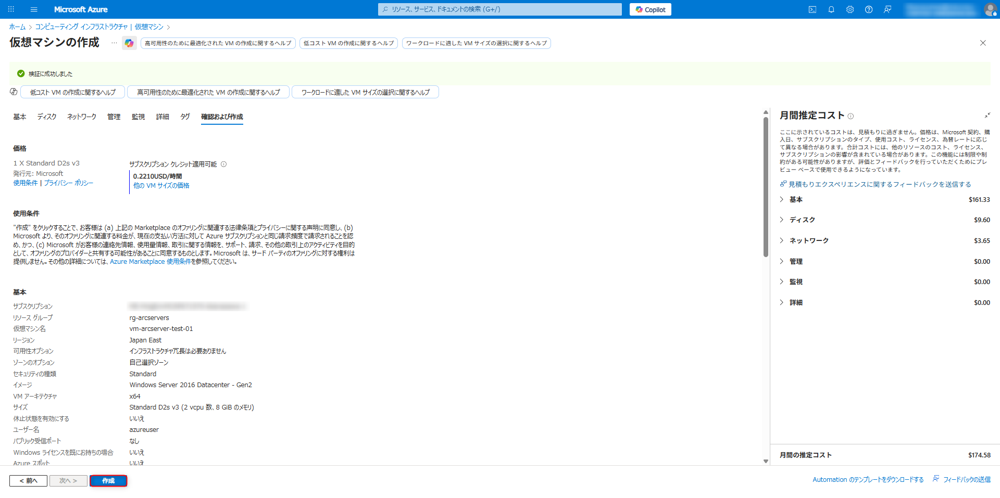
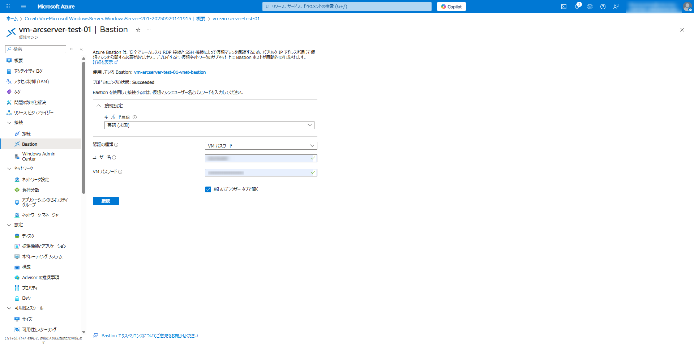

# モジュール 1: Azure Arc 環境の準備

このモジュールでは、Azure Arc でサーバーをオンボーディングするための環境準備を行います。

## 目標

- Azure サブスクリプションの確認
- 必要な Azure リソースプロバイダーの登録
- Azure Arc のリソースグループを準備
- 環境の選択と準備（2 つのオプション）
  - オプション A: Azure VM を使用したシミュレーション環境
  - オプション B: 既存のオンプレミス環境の使用
- 通信要件の確認
- Windows Server 2012/2012 R2 の追加設定（該当する場合）

## 課金に関する注意事項

このハンズオンラボでは、以下の Azure リソースを使用します。これらのリソースには費用が発生します：

- **Windows Server 仮想マシン** (Standard_D2s_v3): $/時間
  [Azure Virtual Machine 価格](https://azure.microsoft.com/ja-jp/pricing/details/virtual-machines/windows/?msockid=300b641468f0694b2ee6716469a968e1)
- **Microsoft Defender for Servers**: $14.60/サーバー/日（Plan 2）
  [Microsoft Defender for Servers 価格](https://azure.microsoft.com/ja-jp/pricing/details/defender-for-cloud/?msockid=300b641468f0694b2ee6716469a968e1)
- **Azure Sentinel / Log Analytics**: 約 $6.24/GB（データ取り込み）
  [Microsoft Sentinel 価格](https://www.microsoft.com/ja-jp/security/pricing/microsoft-sentinel/?msockid=300b641468f0694b2ee6716469a968e1)

※2025 年 9 月時点の価格

**コスト削減のポイント**:

- ラボが完了したら、すぐにリソースをクリーンアップしてください
- VM 作成時に自動シャットダウンを設定してください
- 不要な時間帯は VM を停止状態にしてください

詳しい料金情報については、[Azure 料金計算ツール](https://azure.microsoft.com/ja-jp/pricing/calculator/)を参照してください。

## タスク 1: Azure サブスクリプションの確認

1. [Azure ポータル](https://portal.azure.com)にサインインします。
2. 上部の検索バーで「**サブスクリプション**」と入力し、表示されるサービスをクリックします。
3. サブスクリプションの一覧が表示されます。使用するサブスクリプションがアクティブ状態であることを確認します。
4. サブスクリプション名をクリックして詳細を確認できます。サブスクリプションの状態が「アクティブ」であることを確認します。



## タスク 2: 必要な Azure リソースプロバイダーの登録

このハンズオンラボで必要なリソースプロバイダーを登録します。

1. Azure ポータルの検索バーで「**サブスクリプション**」と入力し、表示されるサービスをクリックします。
2. 使用するサブスクリプションをクリックします。
3. 左側のメニューから「**リソースプロバイダー**」をクリックします。
4. 検索バーに「**Microsoft.HybridCompute**」と入力し、表示されたリソースプロバイダーが「登録済み」でない場合は、選択して「**登録**」をクリックします。
5. 同様に、以下のリソースプロバイダーも登録されていることを確認します：
   - Microsoft.GuestConfiguration
   - Microsoft.HybridConnectivity
   - Microsoft.AzureArcData ※SQL Sever の Azure Arc 登録を行う場合のみ



## タスク 3: Azure Arc 対応サーバーのリソースグループを作成する

1. Azure ポータルの検索バーに「**リソースグループ**」と入力し、表示されるサービスをクリックします。
2. 「**作成**」をクリックします。
3. 以下の設定を入力します：
   - **サブスクリプション**: ご使用のサブスクリプション
   - **リソースグループ**: rg-arcservers
   - **地域**: お近くのリージョン
4. 「**確認および作成**」をクリックし、検証が完了したら「**作成**」をクリックします。



## タスク 4: 環境の選択と準備

このラボでは、以下の 2 つの方法からお好みの方法を選択できます：

- **オプション A**: Azure VM を使用したシミュレーション環境
- **オプション B**: 既存のオンプレミスサーバー環境を使用

### 前提条件（共通）

- Windows Server がインストールされた仮想マシンまたは物理サーバー（以下のバージョンがサポートされています）
  - Windows Server 2022
  - Windows Server 2019
  - Windows Server 2016
  - Windows Server 2012 R2
  - Windows Server 2012
    詳細は[こちら](https://learn.microsoft.com/ja-jp/azure/azure-arc/servers/prerequisites#supported-environments)
- 管理者権限を持つアカウント
- ファイアウォールで以下のポートが開放されていること:
  - TCP 443 (HTTPS)
  - TCP 445 (SMB)

> **注意**: Windows Server 2012/2012 R2 を使用する場合、以下の追加作業が必要です:
>
> - .NET Framework 4.6 以上のインストール
> - WMF (Windows Management Framework) 5.1 のインストール
> - TLS 1.2 の有効化
>
> これらの設定手順は、タスク 3.1「Windows Server 2012/2012 R2 の追加設定」で説明します。

### オプション A: Azure VM を使用したシミュレーション環境のセットアップ

このオプションでは、Azure VM を使用してオンプレミス環境をシミュレーションします。

1. Azure ポータルの検索バーで「**仮想マシン**」と入力し、表示されるサービスをクリックします。
2. 「**作成**」→「**Azure 仮想マシン**」をクリックします。
3. 以下の設定で仮想マシンを構成します：

   - **サブスクリプション**: ご使用のサブスクリプション
   - **リソースグループ**: 新規作成「rg-arcservers」
   - **仮想マシン名**: 任意
   - **地域**: お近くのリージョン
   - **可用性オプション**: インフラストラクチャ冗長は必要ありません
   - **セキュリティの種類**: Standard
   - **イメージ**: Windows Server 2016 Datacenter - x64 Gen2
   - **サイズ**: Standard_D2s_v3（2 vCPU、8 GiB メモリ）または同等
   - **ユーザー名**: 任意
   - **パスワード**: 任意（複雑なパスワードを設定し、メモしておいてください）
   - **パブリック受信ポート**: なし



4. 「**ディスク**」タブで、以下を確認します：

   - **OS ディスクサイズ**: イメージの規定値（127GiB）
   - **OS ディスクの種類**: Standard SSD（ローカル冗長ストレージ）
   - **VM と共に削除**: チェック



5. 「**ネットワーク**」タブで、以下を確認します：

   - **仮想ネットワーク**: 新規
   - **サブネット**: 新規
   - **パブリック IP**: 新規
   - **NIC ネットワークセキュリティグループ**: Basic
   - **パブリック受信ポート**: なし
   - **VM が削除されたときにパブリック IP と NIC を削除する**: チェック



6. 「**確認および作成**」をクリックし、検証が完了したら「**作成**」をクリックします。



8. デプロイが完了するまで待ちます（約 5 分程度）。

拡張機能削除、エージェントのアンインストール
https://zenn.dev/microsoft/articles/zenn-arc-enabledservers-instruction
https://www.nobtak.com/entry/arc02

#### Azure VM への接続とセットアップ

1. デプロイが完了したら、作成した仮想マシンの概要ページに移動します。
2. 「**接続**」→「**Bastion**」をクリックします。
3. 仮想マシン作成時に設定したユーザ名とパスワードを入力し、「**接続**」をクリックします。



4. サーバーマネージャーが自動的に起動したら、「**ローカルサーバー**」をクリックします。
5. 「**IE セキュリティ強化の構成**」の設定で「**オフ**」をクリックします（管理者のみ）。

### オプション B: 既存のオンプレミスサーバー環境の確認

このオプションでは、既存のオンプレミス環境のサーバーを使用します。

#### 事前確認事項

1. Windows Server マシンに管理者としてログインします。
2. サーバーマネージャーを開き、「**ローカルサーバー**」をクリックします。
3. 「**IE セキュリティ強化の構成**」の設定が「**オフ**」になっていることを確認します（管理者のみ）。

#### プロキシ設定の確認（プロキシ環境を使用している場合）

1. スタートメニューを右クリックし、「**Windows PowerShell (管理者)**」を選択します。
2. 次のコマンドを実行して、システム全体のプロキシ設定を確認します:

```powershell
netsh winhttp show proxy
```

3. プロキシ設定が表示されることを確認します。表示されない場合は、次のコマンドでプロキシを設定します（プロキシアドレスは環境に合わせて変更してください）:

```powershell
netsh winhttp set proxy "http://proxy.example.com:8080"
```

4. 認証が必要なプロキシの場合は、後のモジュールでエージェントのインストール時に認証情報を指定します。

## タスク 3.1: Windows Server 2012/2012 R2 の追加設定

> **注意**: このタスクは Windows Server 2012 または Windows Server 2012 R2 を使用する場合のみ実行してください。

Windows Server 2012/2012 R2 では、Azure Arc エージェントの要件を満たすために以下の追加設定が必要です：

### .NET Framework 4.6 以上のインストール

1. [Microsoft ダウンロードセンター](https://dotnet.microsoft.com/ja-jp/download/dotnet-framework/net48)から .NET Framework 4.8 をダウンロードします。
2. ダウンロードしたインストーラー（ndp48-x86-x64-allos-jpn.exe）を実行し、指示に従ってインストールを完了します。
3. インストール完了後、サーバーを再起動します。

### Windows Management Framework (WMF) 5.1 のインストール

1. [Microsoft ダウンロードセンター](https://www.microsoft.com/en-us/download/details.aspx?id=54616)から WMF 5.1 をダウンロードします。
2. ダウンロードしたインストーラー（Win8.1AndW2K12R2-KB3191564-x64.msu）を実行し、指示に従ってインストールを完了します。
3. インストール完了後、サーバーを再起動します。

### TLS 1.2 の有効化

1. 管理者として PowerShell を開き、以下のコマンドを実行して TLS 1.2 を有効にします：

```powershell
# TLS 1.2の有効化
[Net.ServicePointManager]::SecurityProtocol = [Net.SecurityProtocolType]::Tls12

# レジストリに永続的に設定
New-Item -Path "HKLM:\SYSTEM\CurrentControlSet\Control\SecurityProviders\SCHANNEL\Protocols\TLS 1.2\Client" -Force
New-ItemProperty -Path "HKLM:\SYSTEM\CurrentControlSet\Control\SecurityProviders\SCHANNEL\Protocols\TLS 1.2\Client" -Name "Enabled" -Value 1 -PropertyType DWORD -Force
New-ItemProperty -Path "HKLM:\SYSTEM\CurrentControlSet\Control\SecurityProviders\SCHANNEL\Protocols\TLS 1.2\Client" -Name "DisabledByDefault" -Value 0 -PropertyType DWORD -Force
New-Item -Path "HKLM:\SYSTEM\CurrentControlSet\Control\SecurityProviders\SCHANNEL\Protocols\TLS 1.2\Server" -Force
New-ItemProperty -Path "HKLM:\SYSTEM\CurrentControlSet\Control\SecurityProviders\SCHANNEL\Protocols\TLS 1.2\Server" -Name "Enabled" -Value 1 -PropertyType DWORD -Force
New-ItemProperty -Path "HKLM:\SYSTEM\CurrentControlSet\Control\SecurityProviders\SCHANNEL\Protocols\TLS 1.2\Server" -Name "DisabledByDefault" -Value 0 -PropertyType DWORD -Force
```

2. サーバーを再起動して、設定を適用します。

## タスク 4: 通信要件の確認

Azure Arc エージェントが正常に動作するには、特定のエンドポイントへの通信が必要です。これらのエンドポイントへの通信が可能であることを確認してください。

### 必要なエンドポイント

以下のエンドポイントへのアウトバウンド通信（TCP 443）が許可されていることを確認してください：

#### インストール時の通信要件

| 通信先                   | 説明                                                                 | 必要となるタイミング | プライベートリンク\* |
| ------------------------ | -------------------------------------------------------------------- | -------------------- | -------------------- |
| `aka.ms`                 | インストール中にダウンロードスクリプトを解決するために使用されます   | インストール時のみ   | パブリック           |
| `download.microsoft.com` | Windows のインストールパッケージをダウンロードするために使用されます | 　インストール時のみ | パブリック           |
| `package.microsoft.com`  | Linux インストールパッケージをダウンロードするために使用されます     | インストール時のみ   | パブリック           |

#### 利用時の通信要件

| 通信先                                                                           | 説明                                                                              | 必要となるタイミング                                            | プライベートリンク\*             |
| -------------------------------------------------------------------------------- | --------------------------------------------------------------------------------- | --------------------------------------------------------------- | -------------------------------- |
| `login.windows.net`                                                              | Microsoft Entra ID                                                                | 常時                                                            | パブリック                       |
| `login.microsoftonline.com`                                                      | Microsoft Entra ID                                                                | 常時                                                            | パブリック                       |
| `pas.windows.net`                                                                | Microsoft Entra ID                                                                | 常時                                                            | パブリック                       |
| `management.azure.com`                                                           | Azure Resource Manager - Arc サーバリソースを作成または削除                       | サーバーを接続または切断する場合のみ                            | パブリック\*                     |
| `*.his.arc.azure.com`                                                            | メタデータとハイブリット ID サービス                                              | 常時                                                            | プライベートリンク対応           |
| `*.guestconfiguration.azure.com`                                                 | 拡張機能管理とゲスト構成サービス                                                  | 常時                                                            | プライベートリンク対応           |
| `guestnotificationservice.azure.com` <br> `*.guestnotificationservice.azure.com` | 拡張機能と接続のシナリオ用の通知サービス                                          | 常時                                                            | パブリック                       |
| `azgn*.servicebus.windows.net`                                                   | 拡張機能と接続のシナリオ用の通知サービス                                          | 常時                                                            | パブリック                       |
| `*.servicebus.windows.net`                                                       | Windows Admin Center と SSH のシナリオの場合                                      | Azure から SSH または Windows Admin Center を使用する場合       | パブリック                       |
| `*.waconazure.com`                                                               | Windows Admin Center 接続の場合                                                   | Windows Admin Center を使用している場合                         | パブリック                       |
| `*.blob.core.windows.net`                                                        | Azure Arc 対応サーバー拡張機能のダウンロード元                                    | 常時（プライベートエンドポイントを使用する場合を除く）          | プライベートリンク構成時は不使用 |
| `dc.services.visualstudio.com`                                                   | エージェントテレメトリ                                                            | オプション。エージェントバージョン 1.24 以降では使用されません  | パブリック                       |
| `*.<region>.arcdataservices.com`                                                 | Arc SQL Server の場合。データ処理サービス、サービステレメトリ、パフォーマンス監視 | 常時                                                            | パブリック                       |
| `www.microsoft.com/pkiops/certs`                                                 | ESU の中間証明書の更新プログラム（HTTP/TCP 80 と HTTPS/TCP 443）                  | Azure Arc によって有効にされる ESU 使用時。自動更新には常時必要 | パブリック                       |

\*リソース管理のプライベートリンクも構成されていない限り

## タスク 5: PowerShell 実行ポリシーの設定

1. スタートメニューを右クリックし、「**Windows PowerShell (管理者)**」を選択します。
2. 次のコマンドを実行して、PowerShell の実行ポリシーを変更します：

```powershell
Set-ExecutionPolicy -ExecutionPolicy Unrestricted -Force
```

## 次のステップ

これで環境のセットアップが完了しました。選択したオプション（Azure VM またはオンプレミスサーバー）に関わらず、次のモジュールでは、Azure Arc を使用してサーバーをオンボーディングします。

[モジュール 2: Azure Arc でのサーバーオンボーディング](../module2/README.md)に進みます。
