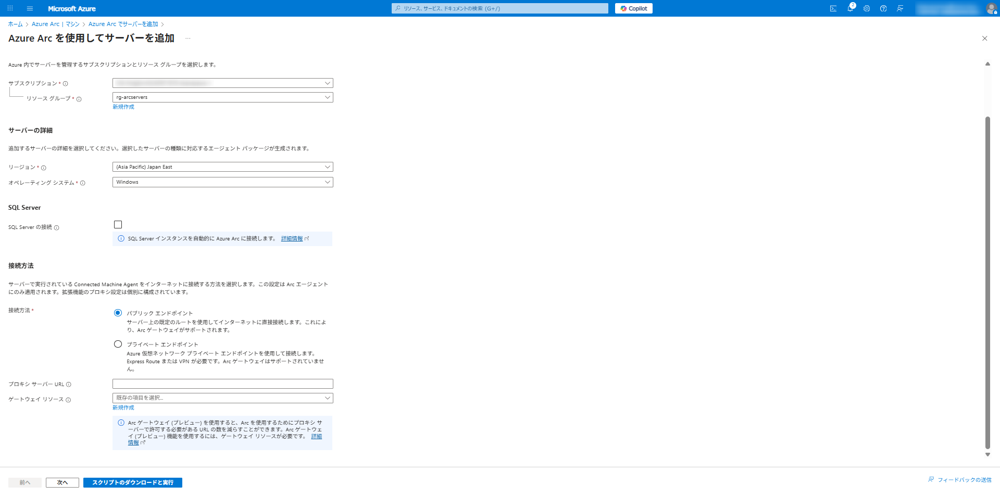

# モジュール 2: Arc Connected Machine Agent のインストール

このモジュールでは、オンプレミス環境のサーバーを Azure Arc を使用してオンボーディングします。

## 目標

- サーバーの準備と確認
- Azure Arc 接続スクリプトを生成する
- Arc Connected Machine Agent をインストールする
- エージェント接続を確認する
- Azure Arc 機能を確認する

## タスク 1: サーバーの準備

1. モジュール 1 でセットアップした仮想マシンに Bastion 接続します。
2. スタートメニューを右クリックし、「**Windows PowerShell (管理者)**」を選択します。
3. 次のコマンドを実行して、サーバーの名前を確認します：

```powershell
hostname
```

4. PowerShell ウィンドウを開いたままにしておきます。

## タスク 2: Azure Arc 接続スクリプトを生成する

1. Azure ポータルで、検索バーに「**Azure Arc**」と入力し、表示されるサービスをクリックします。
2. 左側のメニューから「**インフラストラクチャ - マシン**」をクリックします。
3. 「**オンボード/作成**」ボタンをクリックします。
4. 「**既存のマシンをオンボードする**」をクリックします。


6. 次の設定を入力します：
   - **サブスクリプション**: ご使用のサブスクリプション
   - **リソースグループ**: rg-arcservers
   - **地域**: 任意
   - **オペレーティングシステム**: Windows
   - **接続方法**: パブリックエンドポイント
     ※プロキシ経由であればその設定を入れる旨の記載をする
     ※ExpressRoute 経由の設定は可能だが、インターネット経由が必要であることに関しては注意が必要
   - **認証**:
     - **個別オンボード**: マシンを手動で認証する
     - **複数オンボード**: マシンを自動的に認証する（サービスプリンシパルが必要）

     > **複数オンボードでサービスプリンシパルを新規作成する場合**
     >
     > 「複数オンボード」を選択すると、この画面から直接サービスプリンシパルを作成できます：
     >
     > 1. 「**サービス プリンシパル**」フィールドで「**新規作成**」を選択します。
     > 2. 以下の項目を設定します：
     >    - **サービスプリンシパルの名前**: 任意の名前を入力
     >    - **スコープ**: サブスクリプション全体 または 特定のリソースグループ
     >    - **クライアントシークレットの有効期間**: 必要に応じて選択
     > 3. 「**ロールの割り当て**」で「**Azure Connected Machine Onboarding**」を選択します。
     > 4. 「**作成**」をクリックしてサービスプリンシパルを作成します。
     > 5. 作成後、生成されたスクリプトにサービスプリンシパルの情報が自動的に含まれます。



7. 「**次へ: タグ**」をクリックします。
8. 任意のタグを追加します（例: Environment=Lab）。
9. 「**次へ: スクリプトのダウンロード**」をクリックします。
10. 「**スクリプトのダウンロード**」をクリックし、スクリプトをダウンロードまたはコピーします。


## タスク 3: Arc Connected Machine Agent のインストール

> **Note**: 以下の手順は「個別オンボード」（単一サーバー）を選択した場合の手順です。
>
> **複数台を一括でオンボードする場合**は、「複数オンボード」で生成したサービスプリンシパル付きスクリプトを使用することで、対話的な認証なしで各サーバーに自動展開できます。展開方法の例：
>
> - グループポリシー（GPO）を使用したスクリプト配布
> - SCCM / Microsoft Endpoint Configuration Manager による展開
> - Ansible、Terraform などの構成管理ツール
> - Azure Automation の Update Management
> - PowerShell リモート実行（Invoke-Command）\
>   https://learn.microsoft.com/ja-jp/azure/azure-arc/servers/onboard-service-principal?tabs=portal

### オプション A: Azure VM を使用した場合

1. ダウンロードまたはコピーしたスクリプト（OnboardingScript.ps1）を対象の仮想マシンで実行します。

2. 対象サーバー の管理者 PowerShell で、スクリプトがある場所に移動します：

```powershell
cd C:\path\to\script\folder
```

3. スクリプトを実行します：

```powershell
.\OnboardingScript.ps1
```

4. スクリプトが実行されると、Azure 認証が要求されます。表示される URL にアクセスし、コードを入力してログインします。
5. インストールが完了するまで待ちます（約 5 分程度）。

### オプション B: オンプレミス仮想マシンを使用した場合

1. ダウンロードしたスクリプト（OnboardingScript.ps1）をオンプレミス Windows Server マシンにコピーします。例えば：
   - USB ドライブを使用してスクリプトを転送する
   - ファイル共有を介してスクリプトをコピーする
   - オンプレミスサーバーから直接 Azure ポータルにアクセスしてスクリプトをダウンロードする

2. 管理者 PowerShell で、スクリプトがある場所に移動します：

```powershell
cd C:\path\to\script\folder
```

3. スクリプトを実行します：

```powershell
.\OnboardingScript.ps1
```

4. スクリプトが実行されると、Azure 認証が要求されます。表示される URL にアクセスし、コードを入力してログインします。
5. インストールが完了するまで待ちます（約 5 分程度）。

> **注意**: オンプレミス環境から Azure に接続する場合、プロキシ設定が必要な場合があります。その場合はスクリプト内のプロキシ設定部分を適宜変更してください。

## タスク 4: オンボーディングの確認

1. Azure ポータルに戻り、「**Azure Arc**」→「**マシン - Azure Arc**」に移動します。
2. リストにサーバーが表示され、ステータスが「接続済み」になっていることを確認します。
3. サーバーをクリックして、詳細ページを確認します。


## 次のステップ

これで、オンプレミスサーバーが Azure Arc に正常にオンボーディングされました。次のモジュールでは、Microsoft Defender for Servers を有効化して構成します。

[モジュール 3: Microsoft Defender for Servers の有効化と構成](../module3/README.md)に進みます。
