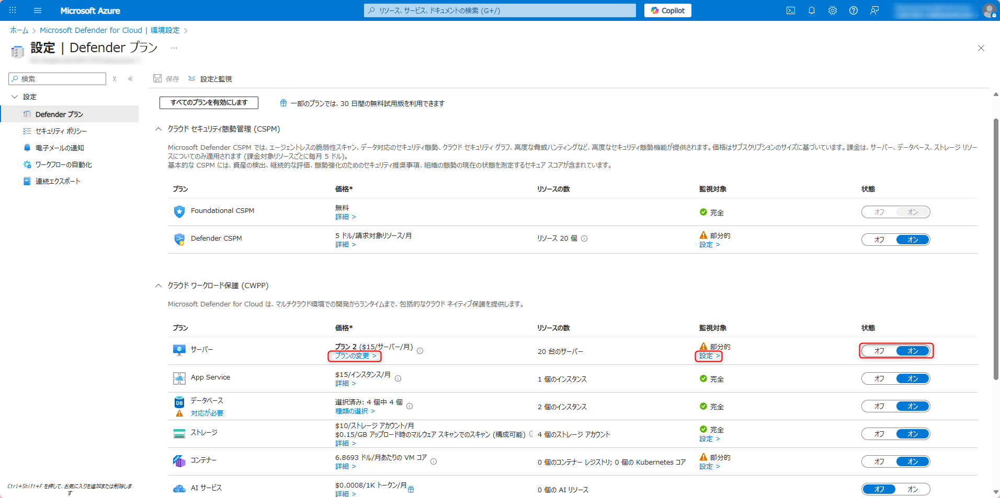
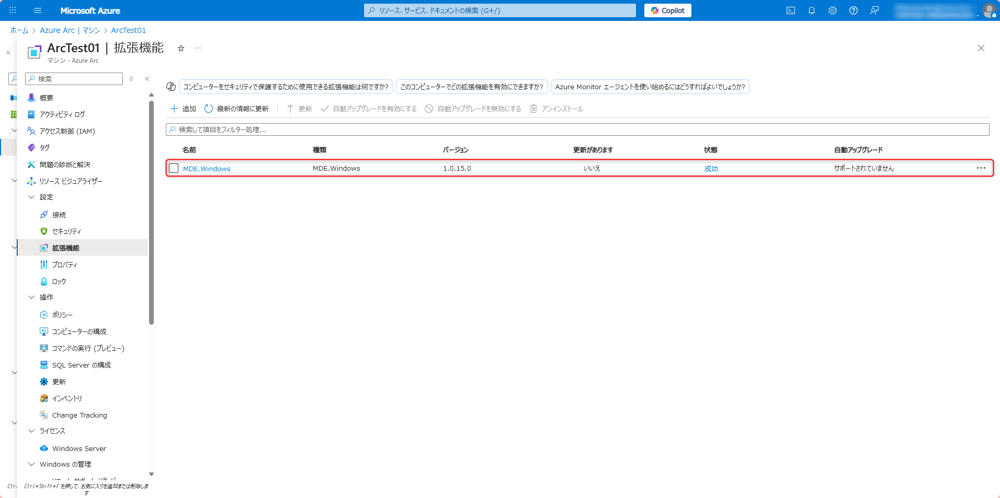
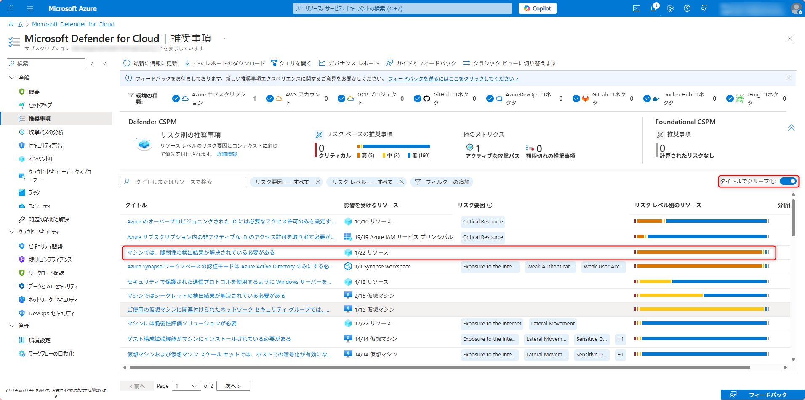
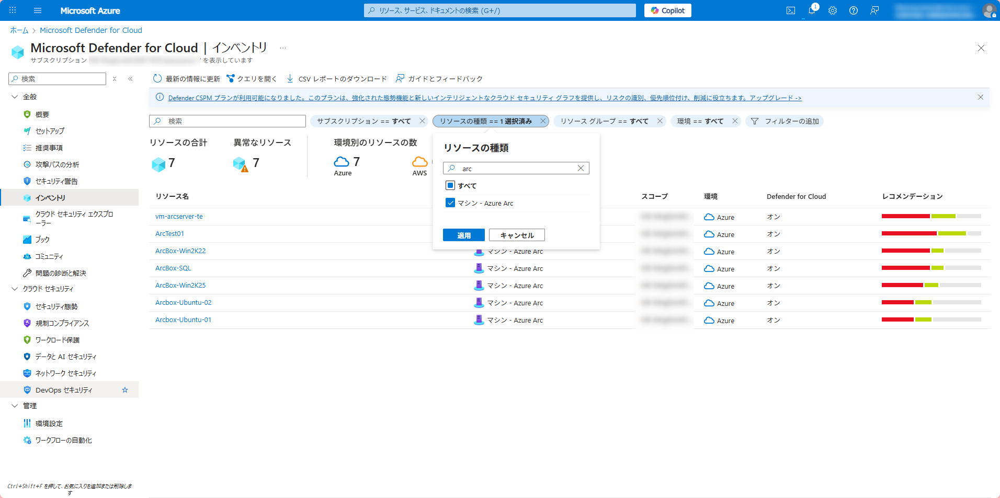

# モジュール 3: Microsoft Defender for Servers の有効化と構成

このモジュールでは、Azure Arc に接続したサーバーに Microsoft Defender for Servers を有効化し、構成します。

## 目標

- Microsoft Defender for Cloud を有効化する
- Azure Arc 接続サーバーに Defender for Servers を有効化する
- Defender プランの機能を確認する
- 脆弱性評価を設定する

## Defender for Servers の料金

Microsoft Defender for Servers には以下のプランがあります：

1. **Plan 1（基本機能）**: $4.906/サーバー/月

   - Defender for endpoint と統合し、EDR（検出と対応）を中心とした基本保護を提供

2. **Plan 2（高度な機能）**: $14.60/サーバー/月
   - Plan 1 のすべての機能
   - エージェントレス スキャン（脆弱性・マルウェア・シークレットなど）
   - コンプライアンス評価（規制基準や Microsoft クラウドセキュリティベンチマーク対応）
   - OS 更新・構成評価、ファイル整合性監視、Just-In-Time アクセス制御、ネットワークマップ
   - Defender Vulnerability Management Premium 機能＋特定データ型の無料インジェスト枠

このラボでは **Plan 2** を使用します。

## タスク 1: Microsoft Defender for Cloud を有効化する

1. [Azure ポータル](https://portal.azure.com)にサインインします。
2. 検索バーに「**Microsoft Defender for Cloud**」と入力し、表示されるサービスをクリックします。
3. 初めて利用する場合は、ウェルカムページが表示されます。「**アップグレード**」をクリックします。
4. 「**管理**」セクションから「**環境設定**」をクリックします。
5. サブスクリプションを選択します。
6. 「**Defender プラン**」タブをクリックします。
7. 「**設定と監視**」セクションで、「**Defender for Servers プラン 2**」を選択します。
8. 「**保存**」をクリックします。

## タスク 2: Defender エージェントのインストール状態の確認

1. Azure ポータルで「**Azure Arc**」→「**マシン - Azure Arc**」に移動します。
2. 対象の Arc 対応サーバをクリックします。
3. 左側のメニューの設定から「**拡張機能**」をクリックします。
4. 次の拡張機能がインストールされていることを確認します：
   - MDE.Windows

## タスク 3: 脆弱性評価の設定

脆弱性評価も自動展開されますが、こちらの機能は「推奨事項」から強制適用することも可能です。以下の手順で適用状況を確認し、強制適用を行います。

1. Aure ポータルで「**Defender for Cloud**」と入力し、表示されるサービスをクリック。
2. 「**全般**」セクションから「**推奨事項**」をクリックします。
3. 「タイトルでグループ化」し、「マシンには脆弱性評価ソリューションが必要(Machines should have a vulnerability assessment solution)」を探して選択

4. 「影響を受けるリソース」から脆弱性評価を展開したいリソースを選択して「修正」
5. Microsoft Defender 脆弱性の管理 を選択して「続行」、「N 個のリソースの修正」を選択
6. Defender for Cloud の推奨事項で「マシンには脆弱性評価ソリューションが必要」を再度開く
7. 影響を受けるリソース、正常なリソースに設定したリソースがあることを確認

## タスク 4: Defender for Servers のコンプライアンス状態の確認

1. Microsoft Defender for Cloud の左側のメニューから「**インベントリ**」をクリックします。
2. リソースのフィルタを設定して「マシン - Azure Arc」を選択します。
3. 対象の Azure Arc 対応サーバを確認し、推奨事項を確認します。これらの推奨事項は、時間と共に更新されます。

## 次のステップ

これで、Azure Arc に接続したサーバーに Microsoft Defender for Servers が正常に有効化されました。次のモジュールでは、テスト攻撃シナリオを実施して、セキュリティイベントを生成します。
