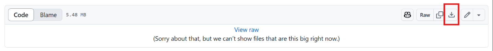
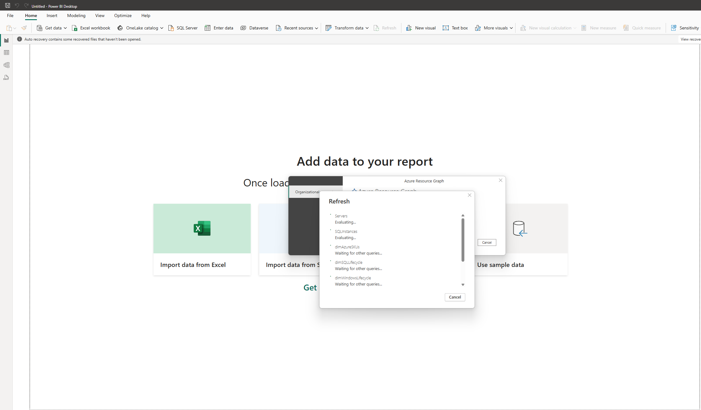
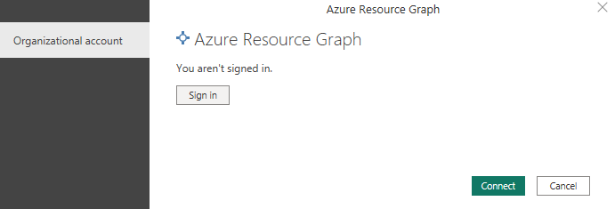
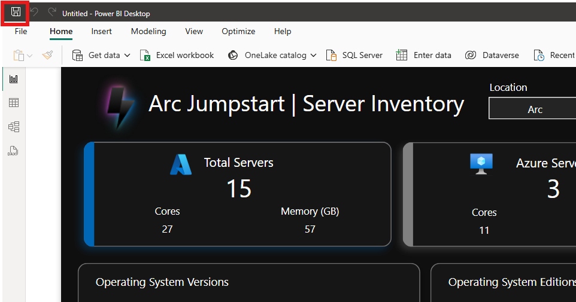

# オプション モジュール: Azure Arc Insights Power BI ダッシュボード

このオプションモジュールでは、Azure と Arc 対応サーバー、SQL Server VM インスタンス、SQL VM データベースの情報を一元的に管理するダッシュボードを提供します。

## 目標

- Azure と Arc 対応サーバー、SQL Server VM インスタンス、SQL VM データベースの情報が一元的に管理できる
- Windows 2016 の ESU に向けたコスト試算が確認できる

## 前提条件

- Azure サブスクリプション。
- Azure サブスクリプション内の Arc 対応サーバー。サブスクリプションに Arc 接続リソースがない場合、ダッシュボードの更新時にエラーが発生することがあります。
- Arc 対応の SQL Server VM がある場合は、SQL Server 拡張機能を有効にする必要があります。
- Azure Resource Graph への読み取りアクセス権を持つ Azure 資格情報、Azure サブスクリプション。詳細については、「Azure Resource Graph のアクセス許可」を参照してください。
- インターネット接続。
- Microsoft Power BI デスクトップ。

## タスク 1: Arc Insights PBI ダッシュボードをインストール

1. Power BI テンプレートファイルを[ここ](https://github.com/Azure/arc_jumpstart_drops/blob/main/ui_dashboard_workbook/arc_pbi_dashboard/arc_insights_dashboard_jumpstart.pbit)からダウンロードする

## タスク 2: Power BI ダッシュボードの表示

1. ダウンロードした Power BI テンプレートファイルを開き、最初にダッシュボードを開くと更新が施行されます。

2. 更新中に、Power BI は以下のように「**Azure Resource Graph**」への読み取りアクセス権を持つアカウントでサインインします

3. ダッシュボードが表示されたら、保存をします。

4. 各タブを確認します。

